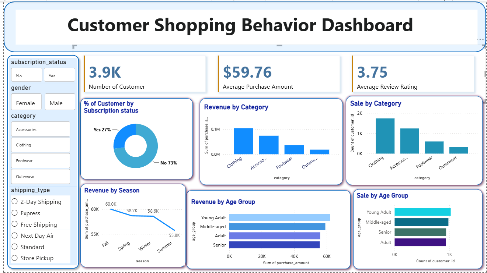

# customer_shopping_behavior_analysis
Data Analytics Project Showcasing Customer behavior analysis using python,sql,power BI

## Project Overview

This project analyzes customer shopping behavior using transactional retail data to uncover insights into customer preferences, purchasing patterns, subscription behavior, and revenue trends. The objective is to help a retail company improve customer engagement, optimize marketing strategies, and increase overall sales performance through data-driven decision-making.

The project follows a complete data analytics workflow involving:

* Data Cleaning & Transformation using Python
* Business Analysis using SQL (PostgreSQL)
* Interactive Dashboard Development using Power BI
* Business Insights & Recommendations

---

## Business Problem

A leading retail company wants to better understand customer shopping behavior across demographics, product categories, seasons, and sales channels. Management seeks to identify factors influencing purchasing decisions, repeat purchases, and customer loyalty.

### Key Business Question

**How can the company leverage consumer shopping data to identify trends, improve customer engagement, and optimize marketing and product strategies?**

---

## Dataset Information

### Dataset Summary

* Total Records: **3,900**

* Total Features: **18**

* Customer Demographics:

  * Age
  * Gender
  * Location
  * Subscription Status

* Purchase Information:

  * Item Purchased
  * Category
  * Purchase Amount
  * Season
  * Size
  * Color

* Shopping Behavior:

  * Discount Applied
  * Previous Purchases
  * Frequency of Purchases
  * Review Rating
  * Shipping Type
  * Payment Method

---

## Project Workflow

### 1. Data Preparation & Cleaning (Python)

Performed data preprocessing using Python and Pandas:

* Loaded and explored the dataset.
* Identified and handled missing values.
* Imputed missing review ratings using category-wise median values.
* Standardized column names using snake_case naming conventions.
* Created new features:

  * `age_group`
  * `purchase_frequency_days`
* Removed redundant columns after consistency checks.
* Connected Python with PostgreSQL and loaded cleaned data into the database.

### Technologies Used

* Python
* Pandas
* NumPy
* SQLAlchemy
* PostgreSQL

---

## 2. Business Analysis (SQL)

Business-oriented SQL queries were executed in PostgreSQL to answer key questions.

### Analyses Performed

#### Revenue Analysis

* Revenue by Gender
* Revenue by Age Group

#### Customer Insights

* Customer Segmentation (New, Returning, Loyal)
* Repeat Buyers vs Subscription Status

#### Product Analysis

* Top 5 Products by Rating
* Top 3 Products per Category
* Discount-Dependent Products

#### Sales & Marketing Analysis

* High-Spending Discount Users
* Subscribers vs Non-Subscribers
* Shipping Type Comparison

---

## Key Findings

### Customer Segmentation

| Segment   | Customers |
| --------- | --------- |
| Loyal     | 3116      |
| Returning | 701       |
| New       | 83        |

### Top Rated Products

1. Gloves
2. Sandals
3. Boots
4. Hat
5. Skirt

### Discount-Dependent Products

* Hat
* Sneakers
* Coat
* Sweater
* Pants

### Revenue by Age Group

* Young Adults generated the highest revenue.
* Middle-aged customers ranked second.
* Adult and Senior groups contributed similar revenue levels.

### Shipping Insights

Customers selecting Express Shipping showed slightly higher average purchase amounts than Standard Shipping customers.

---

## 3. Power BI Dashboard

An interactive Power BI dashboard was developed to visualize business insights.

### Dashboard Features

* Customer Count KPI
* Average Purchase Amount
* Average Review Rating
* Subscription Analysis
* Revenue by Category
* Sales by Category
* Revenue by Season
* Revenue by Age Group
* Sales Distribution by Age Group

### Dashboard Filters

* Gender
* Subscription Status
* Category
* Shipping Type

---

## Business Recommendations

### 1. Increase Subscription Adoption

Offer exclusive rewards, discounts, and loyalty benefits to encourage more subscriptions.

### 2. Strengthen Customer Loyalty Programs

Target returning customers with personalized offers to convert them into loyal customers.

### 3. Optimize Discount Strategy

Focus discounts on products where promotions significantly influence purchasing decisions while maintaining profitability.

### 4. Promote High-Rated Products

Feature top-rated products in marketing campaigns and recommendations.

### 5. Implement Targeted Marketing

Concentrate advertising efforts on high-revenue age groups and customers who prefer premium shipping options.

---

## Tech Stack

| Tool       | Purpose                             |
| ---------- | ----------------------------------- |
| Python     | Data Cleaning & Feature Engineering |
| Pandas     | Data Manipulation                   |
| PostgreSQL | Data Storage & SQL Analysis         |
| SQL        | Business Querying                   |
| Power BI   | Dashboard & Visualization           |
| GitHub     | Project Version Control             |

---
=> Screenshorts / Demo 

Shows what the dashboard look like :- (customer_shopping_behavior_dashboard.png) 

Example :
[Dashboard Preview](https://github.com/anuradha081/blinkit-sales-powerbi-dashboard/blob/main/blinkit_sales_dashboard.png)

## Conclusion

This project demonstrates how customer shopping data can be transformed into actionable business insights. By combining Python, PostgreSQL, and Power BI, the analysis identifies customer trends, purchasing behavior, and revenue drivers that can support strategic business decisions, improve customer engagement, and increase profitability.

